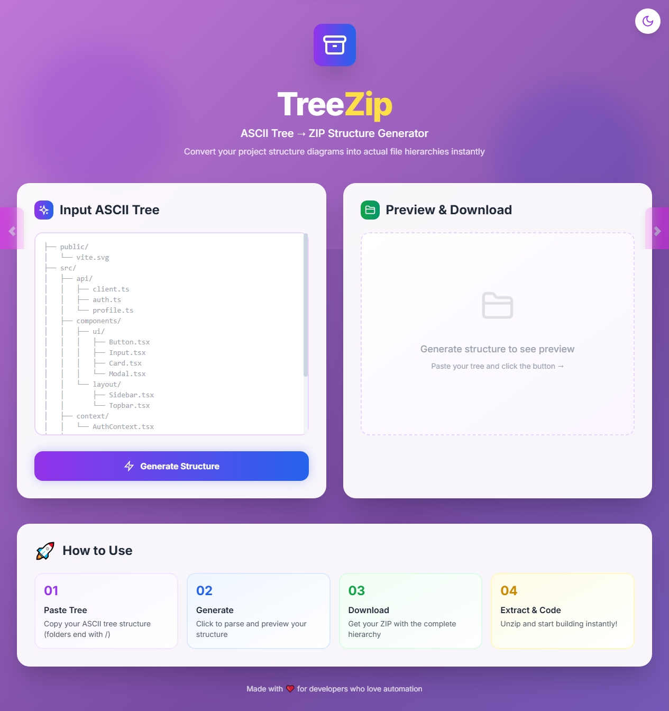

# 🌳 TreeZip - ASCII Tree to ZIP Generator
## 🎯 About

**TreeZip** is a powerful web-based tool that transforms ASCII tree structures into actual downloadable ZIP files with the complete directory hierarchy. Perfect for developers who want to quickly scaffold project structures, share folder layouts, or convert documentation into actual file systems.

Say goodbye to manually creating folder structures! Just paste your ASCII tree and get a ready-to-use ZIP file in seconds.

---

## 🎬 Demo



**Live Demo:** [Try TreeZip Now](https://mainroute-core.github.io/TreeZip/)

---

## ✨ Features

### 🚀 Core Features
- **⚡ Instant Conversion** - Convert ASCII trees to ZIP files in milliseconds
- **🌳 Smart Parsing** - Automatically detects folders and files from ASCII structure
- **📦 ZIP Generation** - Creates authentic directory structures with nested folders
- **👁️ Live Preview** - See your structure before downloading
- **📊 Statistics** - Track folders and files count in real-time

### 🎨 User Interface
- **🌓 Dark/Light Mode** - Toggle between beautiful themes
- **📱 Fully Responsive** - Works seamlessly on desktop, tablet, and mobile
- **🎭 Modern Design** - Glassmorphism effects and smooth animations
- **⚡ Interactive Elements** - Hover effects, transitions, and visual feedback
- **🎨 Gradient Backgrounds** - Dynamic animated gradients

### 🛠️ Technical Features
- **⚛️ React-Powered** - Built with React 18 for optimal performance
- **🎯 Zero Dependencies** - No complex setup required
- **💾 No Backend Needed** - Fully client-side processing
- **🔒 Privacy-First** - All processing happens in your browser
- **📝 Custom Formatting** - Supports various ASCII tree formats

---

## 📥 Installation

### Prerequisites
- A modern web browser (Chrome, Firefox, Safari, Edge)
- No additional software required!

### Quick Start

1. **Clone the repository**
   ```bash
   git clone https://github.com/yourusername/treezip.git
   cd treezip
   ```

2. **Open in browser**
   ```bash
   # Simply open index.html in your browser
   open index.html
   # or
   start index.html
   # or just double-click index.html
   ```

That's it! No build process, no npm install, no configuration needed. 🎉

---

## 🎮 Usage

### Basic Usage

1. **Paste Your ASCII Tree**
   ```
   ├── src/
   │   ├── components/
   │   │   ├── Header.tsx
   │   │   └── Footer.tsx
   │   ├── pages/
   │   │   └── Home.tsx
   │   └── App.tsx
   ├── public/
   │   └── index.html
   └── package.json
   ```

2. **Click "Generate Structure"**
   - Preview your structure in real-time
   - View folder and file counts

3. **Download ZIP**
   - Click "Download ZIP File"
   - Extract and start coding!

### Supported Formats

TreeZip supports standard ASCII tree formats:

```
├── folder/          # Folders end with /
│   ├── file.txt     # Files without /
│   └── nested/
│       └── deep.js
└── another.md
```

**Supported Characters:**
- `├──` Branch
- `└──` Last branch
- `│` Vertical line
- Folders must end with `/`

### Example Use Cases

#### 1. **Project Scaffolding**
```
├── frontend/
│   ├── src/
│   ├── public/
│   └── package.json
├── backend/
│   ├── routes/
│   ├── models/
│   └── server.js
└── README.md
```

#### 2. **Documentation Structure**
```
├── docs/
│   ├── guide/
│   │   ├── intro.md
│   │   └── advanced.md
│   └── api/
│       └── reference.md
```

#### 3. **Component Library**
```
├── components/
│   ├── ui/
│   │   ├── Button.tsx
│   │   ├── Input.tsx
│   │   └── Card.tsx
│   └── layout/
│       └── Container.tsx
```

---

## 🛠️ Technology Stack

| Technology | Purpose |
|------------|---------|
| **React 18** | UI Library |
| **Tailwind CSS** | Styling Framework |
| **JSZip** | ZIP File Generation |
| **Babel Standalone** | JSX Transformation |
| **Vanilla JavaScript** | Core Logic |

### Key Libraries

- **React**: `18.x` - Component-based UI
- **JSZip**: `3.10.1` - Client-side ZIP generation
- **Tailwind CSS**: Latest CDN - Utility-first styling
- **Google Fonts (Inter)**: Modern typography

---

## ⚙️ How It Works

### Architecture Overview

```
┌─────────────────┐
│  User Input     │
│  (ASCII Tree)   │
└────────┬────────┘
         │
         ▼
┌─────────────────┐
│  Parse Tree     │
│  Algorithm      │
└────────┬────────┘
         │
         ▼
┌─────────────────┐
│  Build Node     │
│  Structure      │
└────────┬────────┘
         │
         ▼
┌─────────────────┐
│  Generate ZIP   │
│  with JSZip     │
└────────┬────────┘
         │
         ▼
┌─────────────────┐
│  Download File  │
└─────────────────┘
```

### Parsing Algorithm

1. **Line-by-Line Processing**: Splits input into individual lines
2. **Depth Detection**: Calculates nesting level from leading spaces
3. **Type Recognition**: Identifies folders (ending with `/`) vs files
4. **Tree Building**: Constructs hierarchical node structure
5. **ZIP Creation**: Recursively adds folders and files to ZIP

### Key Functions

```javascript
// Main parsing function
parseTree(treeText) {
  // Splits, cleans, and analyzes each line
  // Returns hierarchical structure
}

// ZIP generation
generateAndDownloadZip() {
  // Creates ZIP using JSZip
  // Recursively adds all folders/files
  // Triggers browser download
}
```

---

## 🌐 Browser Support

| Browser | Version | Status |
|---------|---------|--------|
| Chrome | 90+ | ✅ Fully Supported |
| Firefox | 88+ | ✅ Fully Supported |
| Safari | 14+ | ✅ Fully Supported |
| Edge | 90+ | ✅ Fully Supported |
| Opera | 76+ | ✅ Fully Supported |

**Note:** Modern browsers with ES6+ support required.

---

## 🎨 Customization

### Color Themes

Edit the gradient in `index.html`:

```css
.gradient-bg {
    background: linear-gradient(-45deg, #667eea, #764ba2, #f093fb, #4facfe);
}
```

### Default Tree Template

Modify the initial state in `app.js`:

```javascript
const [input, setInput] = useState(`Your custom template here`);
```

---

## 🐛 Troubleshooting

### Common Issues

**Q: ZIP file is empty**  
A: Make sure folders end with `/` in your ASCII tree

**Q: Structure not generating**  
A: Check that your ASCII tree uses standard characters (`├──`, `│`, `└──`)

**Q: Download not working**  
A: Ensure browser allows downloads and pop-ups from the page

**Q: Dark mode not persisting**  
A: This is by design - theme resets on page reload (no localStorage used)

---

## 🤝 Contributing

Contributions are welcome! Here's how you can help:

1. **Fork the repository**
2. **Create a feature branch**
   ```bash
   git checkout -b feature/AmazingFeature
   ```
3. **Commit your changes**
   ```bash
   git commit -m 'Add some AmazingFeature'
   ```
4. **Push to the branch**
   ```bash
   git push origin feature/AmazingFeature
   ```
5. **Open a Pull Request**

### Development Guidelines

- Follow existing code style
- Test in multiple browsers
- Update documentation for new features
- Keep commits atomic and well-described

### Ideas for Contribution

- [ ] Add drag-and-drop file upload
- [ ] Support for custom file templates
- [ ] Export to different formats (JSON, YAML)
- [ ] Bulk operations support
- [ ] Integration with GitHub API
- [ ] VS Code extension

---

## 👨‍💻 Author

**Your Name**

- GitHub: [@MainRoute-Core](https://github.com/MainRoute-Core/TreeZip)

---

## 🌟 Show Your Support

Give a ⭐️ if this project helped you!

---

## 🙏 Acknowledgments

- Inspired by the need for quick project scaffolding
- ASCII tree format from Unix `tree` command
- Icons from Lucide Icons
- Gradient inspiration from various modern web designs

---

## 🗺️ Roadmap

- [x] Basic ASCII tree parsing
- [x] ZIP file generation
- [x] Dark/Light mode
- [x] Responsive design
- [ ] File content templates
- [ ] Cloud storage integration
- [ ] CLI version
- [ ] Browser extension
- [ ] API endpoint

---

## 💬 FAQ

**Q: Can I use this in my commercial project?**  
A: Yes! It's MIT licensed - free for commercial use.

**Q: Does it work offline?**  
A: After initial load, yes! All processing is client-side.

**Q: Can I add file contents to the ZIP?**  
A: Currently generates empty files. Content templates coming in v2.0!

**Q: How large can my tree structure be?**  
A: No hard limit, but very large structures (1000+ files) may be slow.

---

<div align="center">

**Made with ❤️ by developers, for developers**

[⬆ Back to Top](#-treezip---ascii-tree-to-zip-generator)

</div>